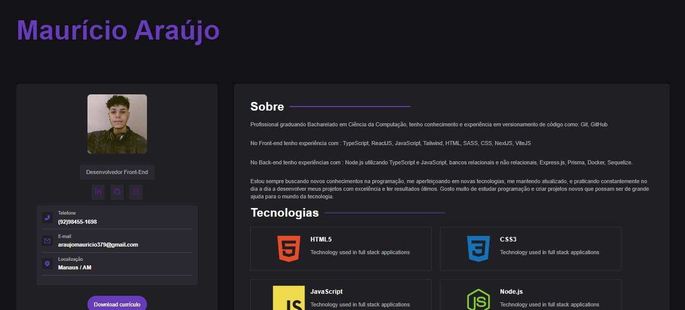

  

<h1 align="center">Meu Portfolio</h1>

Um portfolio dark onde será apresentando sobre minha biografia, tecnologias que eu uso e experiências com diversos projetos.

# 🎉 Portfolio
- Um portfolio web com objetivo de apresentar sobre o meu trabalho como Desenvolvedor Front-End e abordar as tecnologias e projetos criados utilizando frameworks, linguagem de programação, typagem estática e construção de API's.

# ⚙️ Instalação
- Primeiramente você precisar criar um clone do repositório na sua máquina e depois abrir no vscode, logo após ter aberto o clone dentro da IDE Vscode, basta abrir o terminal e escrever o seguinte comando: "npm run dev" para criar um localhost com a tecnologia Vite.js, depois disso basta clicar no ip com as teclas: "Ctrl + Click" e você já irá ser redirecionado para a página da aplicação web. Caso não funcione, apenas instale as dependências com o comando: "npm i", e logo depois executar que irá funcionar normalmente.

# 🧪 Tecnologias utilizadas
- HTML;
- SASS;
- JavaScript;
- React;
- Vite;

# 🤝 Suporte 
Contributions, issues and feature requests are welcome! Feel free to check [issues page](https://github.com/MauricioAraujo1/myPortfolio/issues).

# 👤 Autor
**🕵 Maurício Araújo**

* Github: [MauricioAraujo1](https://github.com/MauricioAraujo1)
* LinkedIn: [@mauricioarj1](https://linkedin.com/in/mauricioarj1)
